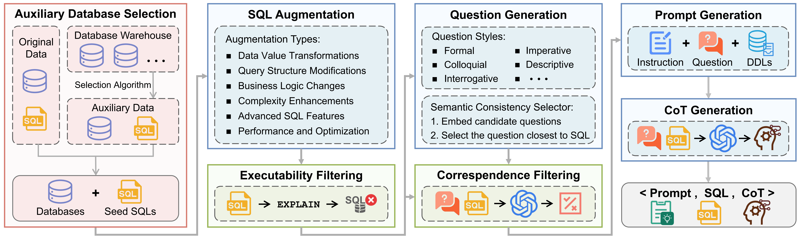
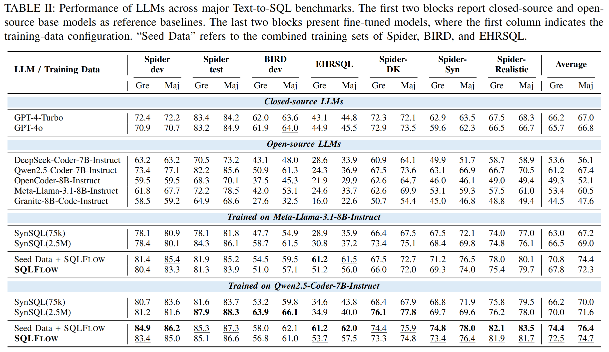

# Text2SQL-Flow: A SQL-Aware Data Augmentation Framework

## Overview

**Text2SQL-Flow** is a comprehensive SQL-aware data augmentation framework that systematically generates large-scale, semantically valid, and structurally diverse Text-to-SQL pairs from limited seed data. This framework addresses the critical challenges in Text-to-SQL tasks where model performance is constrained by the scarcity, limited diversity, and structural simplicity of existing datasets.

<p align="center">
  
</p>

Based on this framework, we introduce SQLFLOW, a high-quality dataset comprising 75,386 annotated examples. The dataset is derived from widely used benchmarks including Spider, BIRD, and EHRSQL, substantially extending their complexity frontiers.

**Paper Link:** [https://arxiv.org/abs/2511.10192v3](https://arxiv.org/abs/2511.10192v3)

**GitHub Link:** [https://github.com/TechNomad-ds/Text2SQL-Flow](https://github.com/TechNomad-ds/Text2SQL-Flow)


## Statistics about SQLFLOW
SQLFLOW is constructed through a pipeline that enhances both distribution-level and query-level diversity.

The dataset includes:
- **Composition**: 75,386 entries in totakl, including 30,502 from Spider-train, 33,163 from BIRD-train, and 11,721 from EHRSQL-train.
- **Rich Annotations**: Each sample consists of &lt;`Augmented SQL`, `Question`, `Schema`, `Prompt`, `CoT reasoning trace`&gt;.
- **Diverse Augmentation**: Covers six dimensions including Data Value Transformations, Query Structure Modifications, and Complexity Enhancements.
- **Quality Control**: All samples are verified via SQL executability and NL-SQL correspondence filters.
- **Dual Application**: Text2SQL-Flow supports both fine-tuning and prompt-based settings with masked alignment retrieval.


## Performance Evaluation
We evaluate models fine-tuned on SQLFLOW across mainstream benchmarks. Under the same data scale, models trained on SQLFLOW consistently outperform those trained on other synthetic datasets like SynSQL.

<p align="center">
  
</p>


## Installation for Data Augmentation

### 1. Setting Up the DataFlow Environment:
```bash
conda create -n text2sql_flow python=3.10
conda activate text2sql_flow
git clone https://github.com/OpenDCAI/DataFlow
cd DataFlow
pip install -e .
```

### 2. Initializing the Working Directory:
```bash
cd ..
mkdir run_dataflow
cd run_dataflow
dataflow init
```

### 3. Configuring API Keys and Model Endpoints: 

#### 3.1 Setting the API Key
Please set your API key via environment variables:
```bash
export DF_API_KEY="sk-xxxxx"
```
#### 3.2 Configuring Model Services
In the pipeline code, configure the language model and embedding model used for data construction. For example:
```bash
self.llm_serving = APILLMServing_request(
    api_url="https://api.openai.com/v1/chat/completions",  # Can be replaced with a custom endpoint
    model_name="gpt-4o",  # Project data was constructed using gpt-4o
    max_workers=100
)

self.embedding_serving = APILLMServing_request(
    api_url="https://api.openai.com/v1/embeddings",
    model_name="text-embedding-ada-002",  # Can be replaced with other embedding models
    max_workers=100
)
```


## Quick Start

### 1. Data Augmentation Pipeline

Run the complete Text2SQL-Flow augmentation pipeline:

```bash
cd data_augmentation
bash run_batch.sh
```

This will:
- Generate Augmented SQL from seed data
- Create natural language questions
- Generate chain-of-thought reasoning traces
- Apply SQL executability and NL–SQL correspondence filters

### 2. LLM Fine-tuning and Evaluation

Fine-tune open-source LLMs on the generated SQLFlow dataset and evaluate fine-tuned LLMs across mainstream Text-to-SQL benchmarks:

```bash
cd llm_train_and_evalute

# 1. Configure paths and variables in train_llm.sh
# 2. Run training
bash train_llm.sh

# Edit MODELS and paths in eval_bench.sh, then run:
bash eval_bench.sh
```

### 3. Retrieval Model Fine-tuning and Evaluation

Train and use the masked Question-SQL alignment retrieval strategy:

```bash
# Ensure the DAIL-SQL and SWIFT environments are set up.
# See /retrieval_model_train_and_evaluate/README.md for details.
cd retrieval_model_train_and_evaluate

# 1. Build Training Data
cd training_data_process
bash get_training_data.sh

# 2. Train Embedding Model with SWIFT SFT
cd ../model_training
bash run_swift.sh

# 2. Retrieve Few-shot Examples & Build Prompts
cd ../retrieval_stategy
bash rungenerate_retrieval_prompt_swift.sh
```


## Downloads
| **Model and Dataset** | **Description** | **Download Latest on HuggingFace** |
|---|---|---|
| SQLFlow | Text-to-SQL dataset | [🤗 debugger123/SQLFlow](https://huggingface.co/datasets/debugger123/SQLFlow) |
| SQLFlow-Retrieval-0.6B | Embedding model used for few-shot example retrieval | [🤗 xccr/SQLFlow-Retrieval-0.6B](https://huggingface.co/xccr/SQLFlow-Retrieval-0.6B) |

## Bibtex
If you find Text2SQL-Flow helpful, please consider to cite it. Thank you! :)
```bit_tex
@article{cai2026text2sqlflow,
  title={TEXT2SQL-FLOW: A Robust SQL-Aware Data Augmentation Framework for Text-to-SQL},
  author={Cai, Qifeng and Liang, Hao and Xu, Chang and Xie, Tao and Zhang, Wentao and Cui, Bin},
  journal={arXiv preprint arXiv:2511.10192v3},
  year={2026}
}
```
